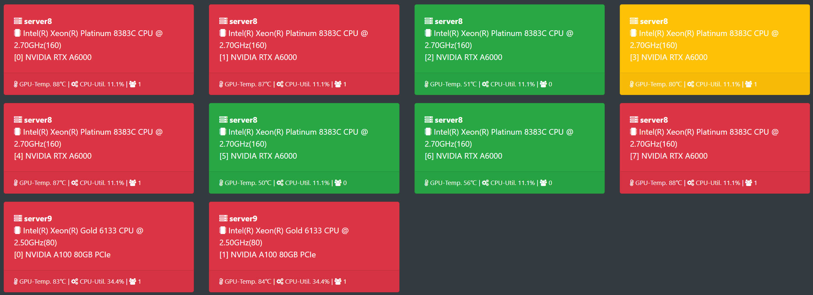
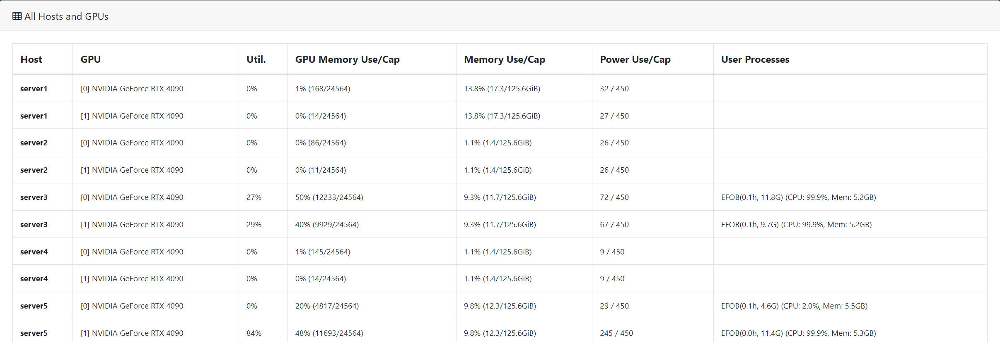

gpuview
=======

[](https://github.com/HuCutie/hucutie_gpuview/blob/master/LICENSE)


GPU is an expensive resource, and deep learning practitioners have to monitor the
health and usage of their GPUs, such as the temperature, memory, utilization, and the users. 
This can be done with tools like `nvidia-smi` and `gpustat` from the terminal or command-line.
Often times, however, it is not convenient to `ssh` into servers to just check the GPU status. 
`gpuview` is meant to mitigate this by running a lightweight web dashboard on top of 
[`gpustat`][repo_gpustat].  

With `gpuview` one can monitor GPUs on the go, though a web browser. Moreover, **multiple GPU servers** 
can be registered into one `gpuview` dashboard and all stats are aggregated and accessible from one place.


Thumbnail view of GPUs across multiple servers. On top of the existing structure, the card section will additionally display the CPU model (logical core count), and at the bottom, it will show the host CPU usage and the number of processes on the GPU.



Usage
-----

`gpuview` can be used in two modes as a temporary process or as a background service.

### Run gpuview
Once `gpuview` is installed, it can be started as follows:
```
$ python3 gpuview/app.py run
```
This will start the dasboard at `http://0.0.0.0:9988`.


By default, `gpuview` runs at `0.0.0.0` and port `9988`, but these can be changed using `--host` and `--port`.

### Run as a Service
To permanently run `gpuview` it needs to be deployed as a background service.
This will require a `sudo` privilege authentication.
The following command needs to be executed only once:

```
$ python3 gpuview/app.py service
```

If successful, the `gpuview` service is run immediately and will also autostart at boot time. It can be controlled using `supervisorctl start|stop|restart gpuview`.


### Runtime options

There a few important options in `gpuview`:

* `run`                : Start `gpuview` dashboard server
  * `--host`           : URL or IP address of host (default: 0.0.0.0)
  * `--port`           : Port number to listen to (default: 9988)
* `add`                : Add a GPU host to dashboard
  * `--url`            : URL of host [IP:Port], eg. http://192.168.0.8:9988
  * `--name`           : Optional readable name for the host, eg. Node101
* `remove`             : Remove a registered host from dashboard
  * `--url`            : URL of host to remove, eg. http://192.168.0.8:9988
* `hosts`              : Print out all registered hosts
* `service`            : Install `gpuview` as system service
  * `--host`           : URL or IP address of host (default: 0.0.0.0)
  * `--port`           : Port number to listen to (default: 9988)

### Monitoring multiple hosts

To aggregate the stats of multiple machines, they can be registered to one dashboard using their address and the port number running `gpustat`.

Register a host to monitor as follows:
```
$ python3 gpuview/app.py add --url <ip:port> --name <name>
```

Remove a registered host as follows:
```
$ python3 gpuview/app.py remove --url <ip:port> --name <name>
```

Display all registered hosts as follows:
```
$ python3 gpuview/app.py hosts
```

> Note: the `gpuview` service needs to run in all hosts that will be monitored.

> Tip: `gpuview` can be setup on a none GPU machine, such as laptops, to monitor remote GPU servers. 


etc
---

Helpful tips related to the underlying performance are available at the [`gpustat`][repo_gpustat] repo.


For the sake of simplicity, `gpuview` does not have a user authentication in place. As a security measure,
it does not report sensitive details such as user names by default.

Detailed view of GPUs across multiple servers. Added the host memory usage information and filtered out processes running inside Docker containers in the last column (to meet our team's requirements, see relevant code in `gpuview/core.py`). Also displayed elapsed time, GPU memory usage, CPU usage, and memory usage.




License
-------

[MIT License](LICENSE)

[repo_gpustat]: https://github.com/wookayin/gpustat
[pypi_gpuview]: https://pypi.python.org/pypi/gpuview
